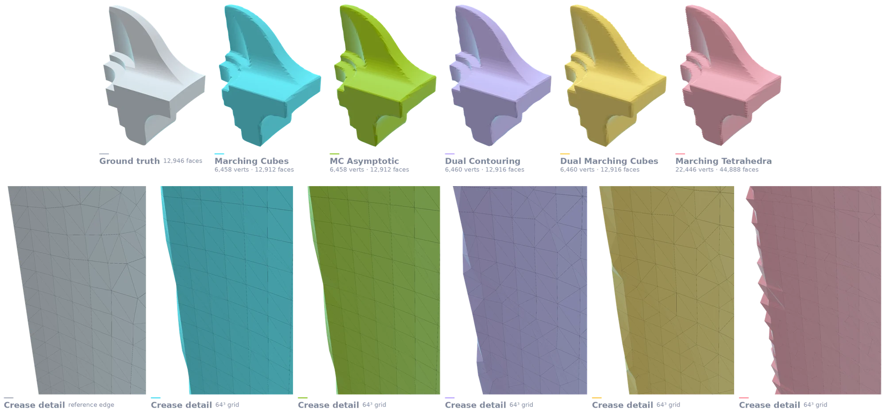
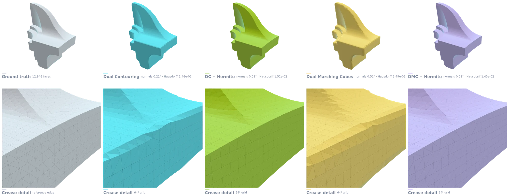
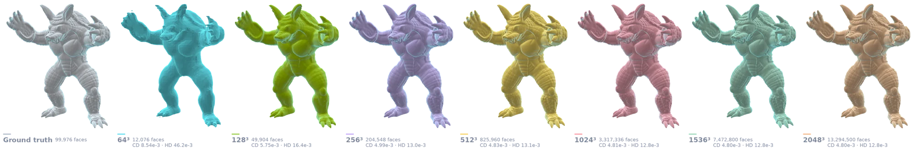
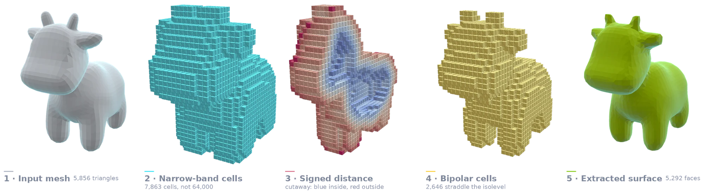
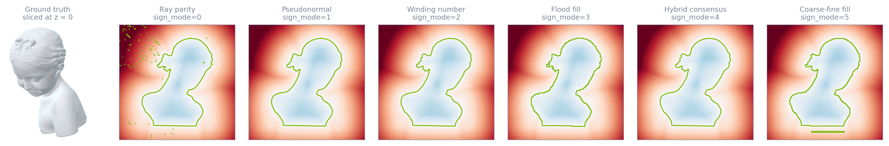
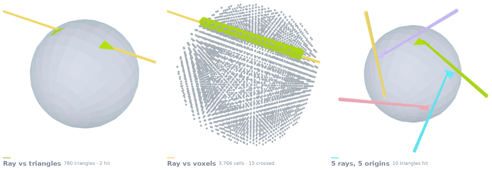

<div align="center">

# ⚡ Conquer3D

### *High-Performance GPU-Accelerated Differentiable Geometry, Spatial Computing & Neural Rendering Toolbox*

[](https://khoidoo.github.io/conquer3d/)
[](https://pypi.org/project/conquer3d/)
[](https://hub.docker.com/r/kohido/conquer3d)
[](LICENSE)

[](https://www.python.org/)
[](https://developer.nvidia.com/cuda-toolkit)
[](https://pytorch.org/)
[](https://khoidoo.github.io/conquer3d/api/index.html)

<p align="center">
  <b><a href="https://khoidoo.github.io/conquer3d/">🌐 Website</a></b> •
  <a href="https://khoidoo.github.io/conquer3d/documentation.html">Guide</a> •
  <a href="https://khoidoo.github.io/conquer3d/api/index.html">API Reference</a> •
  <a href="https://khoidoo.github.io/conquer3d/benchmarks.html">Benchmarks</a> •
  <a href="#-qualitative-results">Results</a> •
  <a href="#-installation">Installation</a>
</p>

</div>

---

> [!NOTE]
> The API documentation and the [documentation website](https://khoidoo.github.io/conquer3d/)
> were written with [Claude](https://claude.ai/code). The library itself — every CUDA kernel,
> data structure and operator — is the author's own work.

---

## 🌟 Overview

**Conquer3D** is an ultra-fast, GPU-native computational geometry and differentiable spatial computing library engineered in **PyTorch and CUDA**. Designed from the ground up for 3D computer vision, generative AI, neural surface reconstruction, and differentiable rendering, **Conquer3D** delivers up to **~1.3 Billion faces/second** isosurface extraction, exact CAD sharp crease preservation, and memory-efficient spatial acceleration structures.

Every operator consumes and produces PyTorch tensors **in place** — no host round-trip, no format conversion — so meshing a field is an operation *inside* a training step rather than a preprocessing stage around it.

```bash
pip install -U conquer3d
```

```python
import torch
from conquer3d.data_structure import create_voxel_grid
from conquer3d.ops import dmc

grid_vertices, voxels, _ = create_voxel_grid(
    grid_min=[-1.0] * 3, grid_max=[1.0] * 3, res=[64, 64, 64], device="cuda"
)

sdf = (torch.norm(grid_vertices, dim=-1) - 0.6).requires_grad_(True)
verts, faces = dmc(grid_vertices, voxels, sdf, iso=0.0)

verts.sum().backward()          # gradients flow back into the field
```

---

## 🔬 Qualitative Results

Every figure below is real library output on the bundled benchmark assets, regenerated
by `docs/_figures/make_figures.py` — nothing is mocked or hand-drawn. More, at full size,
on the **[showcase](https://khoidoo.github.io/conquer3d/)**.

### Isosurface extraction



One signed distance field on a 64³ narrow-band grid of 19,329 cells, meshed by four
extractors — Marching Cubes, MC Asymptotic, Dual Contouring and Dual Marching Cubes —
with the source mesh on the left. The lower row crops the crease where Marching Cubes
and Dual Contouring disagree most.

### Sharp features from Hermite data



Dual Contouring and Dual Marching Cubes run twice each: once with normals interpolated
from the grid, once with exact Hermite data from `compute_hermite_from_mesh`, which
ray-casts all 25,832 sign-crossing edges for the true intersection and face normal.
The crease is reconstructed rather than rounded.

### Detail is a resolution dial



Dual Marching Cubes on the Armadillo at seven grid resolutions from 64³ to 2048³.
Face count runs from 12,076 to 13,294,500, with Chamfer and Hausdorff distance to the
source measured at every step.

### From mesh to surface, step by step



The input mesh, the narrow-band cells allocated around it (7,863 of a possible 64,000
at 40³), the signed distance shown as a cutaway, the 2,646 bipolar cells, and the
extracted surface. No dense volume is ever held.

### Six ways to decide inside



One axial slice signed by each of the six sign modes and contoured at zero — ray parity,
pseudonormal, winding number, flood fill, hybrid consensus, and coarse-fine fill.

### Ray queries against the hierarchies



`MeshBVH.get_ray_intersection` returns the triangles a ray pierces; `BVH.query_ray`
returns the narrow-band cells it crosses. Five rays from five origins, each drawn as far
as its own first hit.

---

## ⚡ Benchmarks

*RTX 4090, torch 2.8.0+cu128, CUDA 12.8. Fandisk at $1024^3$ (5.15M active cells).
CUDA events around the operator alone, median of 7 runs after 2 warm-ups.*

| Algorithm | Output | Vertices | Faces | Latency | Throughput |
| :--- | :--- | ---: | ---: | ---: | ---: |
| **Dual Marching Cubes** | Triangles | 1,716,384 | 3,432,764 | **2.62 ms** | **1,311M faces/s** |
| DMC (pure quads) | Quads | 1,716,384 | 1,716,382 | 2.51 ms | 684M quads/s |
| MC Asymptotic | Triangles | 1,716,382 | 3,432,760 | 2.71 ms | 1,267M faces/s |
| Dual Contouring | Triangles | 1,716,384 | 3,432,764 | 3.88 ms | 884M faces/s |
| Marching Cubes | Triangles | 1,716,382 | 3,432,760 | 7.90 ms | 434M faces/s |
| Marching Tetrahedra | Triangles | 6,113,918 | 12,227,832 | 44.90 ms | 272M faces/s |

Sign-mode costs, distance-operator throughput, pipeline breakdown and memory scaling are
on the **[benchmarks page](https://khoidoo.github.io/conquer3d/benchmarks.html)**.

---

## 📦 Installation

```bash
pip install -U conquer3d
```

Building from source, the full feature list, worked pipelines and the 1,020-symbol API
reference are on the **[documentation site](https://khoidoo.github.io/conquer3d/documentation.html)**.

---

## 📄 License

Conquer3D is licensed under the [MIT License](LICENSE).

<div align="center">
<sub>Built with CUDA and PyTorch · <a href="https://khoidoo.github.io/conquer3d/">khoidoo.github.io/conquer3d</a></sub>
</div>
